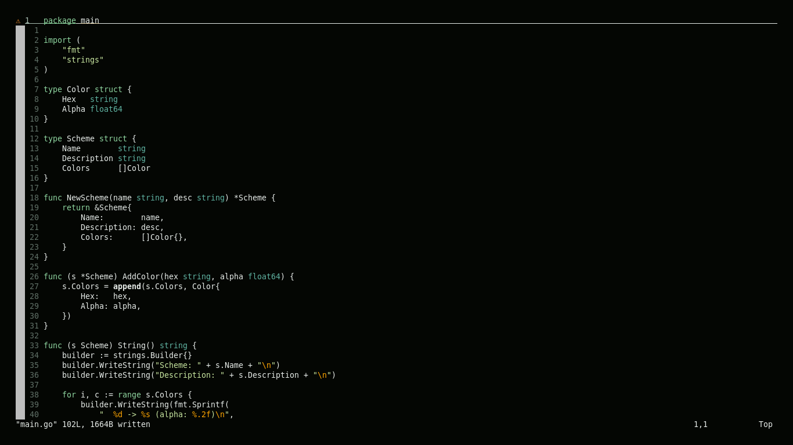

# eyun

**eyun** is a fresh, green-forward Vim colorscheme designed for clarity, balance, and long-term comfort.

It uses a softly tinted dark background and a restrained palette built around greens and gentle accent colors. Syntax elements are clearly separated without relying on harsh contrast, allowing code to remain readable and calm during extended editing sessions.

eyun is built for **classic Vim** and works out of the box with Vim’s default syntax highlighting.

---


##  Features

- Green-forward, calm color palette
- Softly tinted dark background (not pure black)
- Clear syntax distinction for:
  - keywords and control flow
  - functions
  - types and structures
  - strings
  - constants, warnings, and errors
- Minimal, unobtrusive UI elements
- Designed for long coding sessions
- No Neovim or Tree-sitter dependency

---

##  Installation

### Vim native packages (recommended)

Vim 8+ includes a built-in package system. This is the recommended way to install eyun.

```bash
git clone https://github.com/RajaeDev6/eyun.vim ~/.vim/pack/colors/start/eyun
